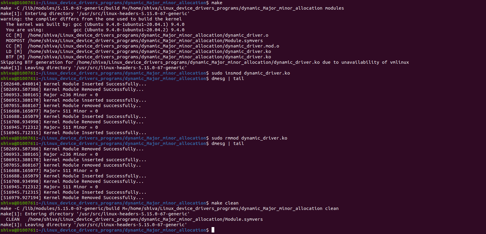

---

# Linux Device Drivers Programs

This repository contains Linux kernel module programs demonstrating fundamental Linux device driver concepts, including **static and dynamic allocation of major and minor numbers**.

---

## 📂 Project Structure

```

.
├── README.md
├── static_Major_minor_allocation
│   ├── static_driver.c
│   ├── Makefile
│   └── Makefile_explanation.docx
├── dynamic_Major_minor_allocation
│   ├── dynamic_driver.c
│   └── Makefile
└── debugged_output
├── static_driver_debug_output.png
└── dynamic_driver_log.png

````

---

## 📌 Programs Included

### 1️⃣ Static Major & Minor Number Allocation
Located in: `static_Major_minor_allocation/`

- Demonstrates **manually assigned (fixed) major and minor numbers**
- Useful for reserved or known device numbers
- Requires careful handling to avoid conflicts

---

### 2️⃣ Dynamic Major & Minor Number Allocation
Located in: `dynamic_Major_minor_allocation/`

- Demonstrates **runtime allocation of device numbers by the kernel**
- Uses `alloc_chrdev_region()`
- Recommended modern approach for character drivers

---

## ⚙️ Build Instructions

Navigate into the respective directory and run:

```bash
make
````

This will compile the kernel module (`.ko` file).

---

## 🚀 Insert Module

### Static Driver

```bash
sudo insmod static_driver.ko
```

### Dynamic Driver

```bash
sudo insmod dynamic_driver.ko
```

---

## 🔍 Verify Module

```bash
lsmod | grep driver
dmesg | tail -n 20
```

---

## ❌ Remove Module

### Static Driver

```bash
sudo rmmod static_driver
```

### Dynamic Driver

```bash
sudo rmmod dynamic_driver
```

---

## 🖼️ Output Screenshots

### Static Driver Output


### Dynamic Driver Output



---

## 📖 Concepts Covered

* Linux Kernel Module Programming
* Character Device Drivers
* Static Major & Minor Number Allocation
* Dynamic Major & Minor Number Allocation
* Kernel Logging using `printk` / `pr_info`
* Writing Makefiles for kernel modules
* Module insertion and removal workflow

---

## 🛠️ Technologies Used

* C Programming Language
* Linux Kernel
* Kernel Module Development
* GNU Make

---

## 👨‍💻 Author

Shiva

---

## 📌 Notes

* Always use `sudo` for inserting/removing kernel modules.
* Check kernel logs using `dmesg` for debugging.
* Dynamic allocation is preferred in modern Linux driver development.

---
