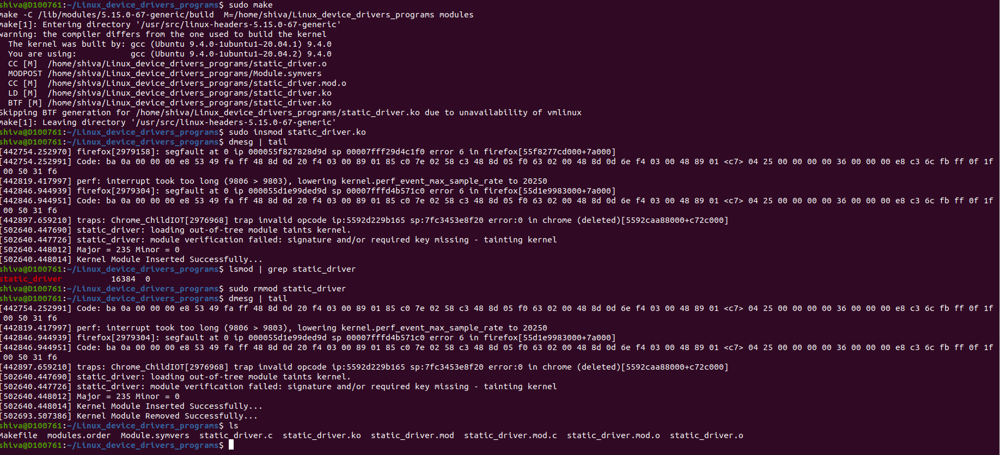

# Linux Device Drivers Programs

This repository contains Linux kernel module programs demonstrating device driver concepts.

---

## 📂 Project Structure

```
.
├── README.md
└── static_Major_minor_allocation
    ├── Makefile
    └── static_driver.c
```

---

## 📌 Static Major & Minor Number Allocation

This module demonstrates how to statically allocate major and minor numbers for a character device driver.

---

## ⚙️ Build Instructions

```bash
make
```

---

## 🚀 Insert Module

```bash
sudo insmod static_driver.ko
```

---

## 🔍 Verify Module

```bash
lsmod | grep static_driver
dmesg | tail
```

---

## ❌ Remove Module

```bash
sudo rmmod static_driver
```

---

## 🖼️ Output Screenshot



---

## 📖 Concepts Covered

* Linux Kernel Module Programming
* Static Major & Minor Number Allocation
* Makefile for Kernel Modules
* Kernel Logs using `printk`

---

## 🛠️ Technologies Used

* C
* Linux Kernel
* Device Drivers

---

## 👨‍💻 Author

Shiva

---

